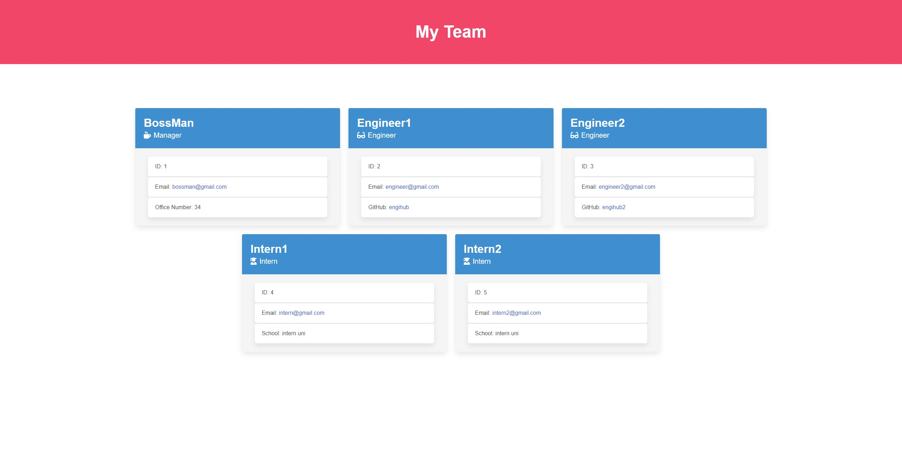

# Module 10

## Description

> Generated using module 9 project!

This is Adrian Jimenez's module 10 Team profile generator challenge submission.

I started this project off by first creating an employee class for all subsequent classes to extend from. Once that was complete, I was able to extend the methods and constructors to the rest of the employee classes I'd created, and then export those classes to have access to the methods across all files I imported them into. Once that was done, I created prompts for the user to enter data, and packaged the data into an array containing all employees the user entered. Using that data, I called a template script to take the data and format it as a template literal, then return it for use in another script. Said script imports the file system module and generates an index.html file as well as a style.css file into the dist/ folder containing all the employee data from the user.

## Table of Contents

- [Installation](#installation)
- [Languages](#languages)
- [Usage](#usage)
- [Credits](#credits)
- [License](#license)
- [Contributing](#contributing)
- [Questions](#questions)

## Installation

In order to install this project, please download all files and have node.js installed on your machine. Navigate to the directory which index.js is stored in and type:

``
    npm install
``

Once all dependencies have been downloaded, you can execute index.js by typing node index.js.

## Languages

* HTML
* CSS
* JavaScript
* Inquirer
* Bulma
* Jest
* Node.JS

## Usage

* [See Video 1:](https://www.youtube.com/watch?v=uCUpvTMis-Y)

In order to use this project, start by calling the index.js file using node index.js. Once this is done, you should be prompted with questions to fill out in the terminal. Fill these questions out as thoroughly as possible, and once all questions have been answered an index.html and style.css file should be generated in the dist folder contained in the package.

## Tests
This project uses the npm package jest to run tests. In order to test the functionality of the program type: 

``
    npm run test 
``

in the terminal, within the root directory of the project.

## Credits

* Adrian Jimenez
* [Email validation](https://stackoverflow.com/questions/46155/how-can-i-validate-an-email-address-in-javascript)

## License

This project is licensed under the MIT License. See [LICENSE.md](./LICENSE.md) for more details.

---

## Contributing

This project follows the contributor covenant contribution guidelines. See [here](https://www.contributor-covenant.org/version/2/1/code_of_conduct/) 

## Questions

If you have any questions or concerns visit my [github](https://github.com/PuppetAJ) or send me an email at <adrianjimenez1950@gmail.com>. 

